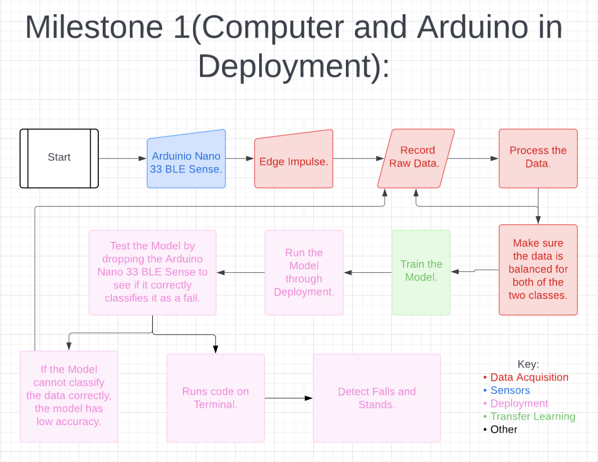
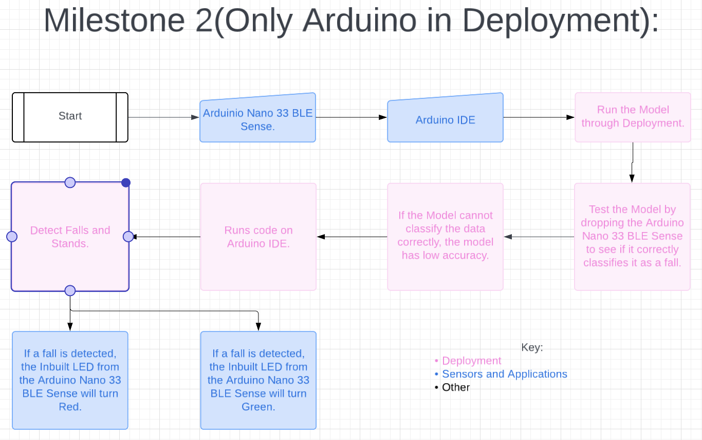
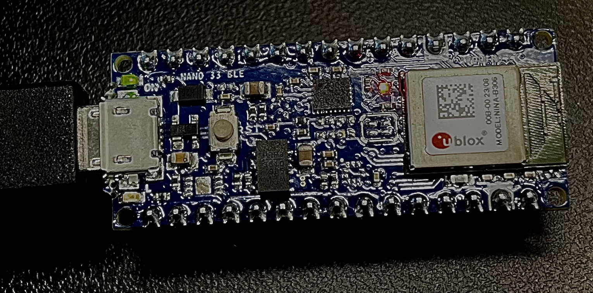
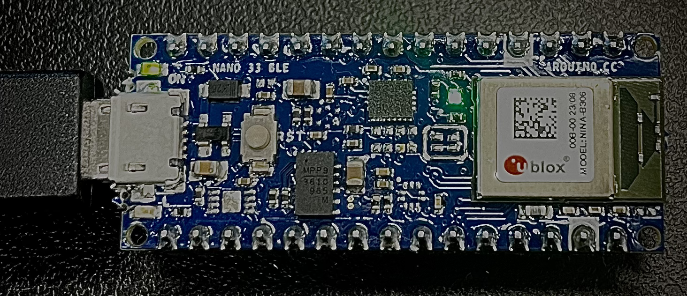

# Fall Detector
The fall detector has a small TinyML, a machine learning device in charge of detecting falls via the onboard accelerometer data, and reporting to a server through Bluetooth (BT). The server is a Python script that scans specific BT announcements, parses the fall alert information, and stores it into a SQL Lite database for reports and alerts. I choose to work on this project because my grandma has a medical condition where she falls when she suddenly hears a noise or when someome passes her unexpecedly. I created this fall detector to help her!

<!---
[Edit the paragraph above to make it better with this prompt] Replace this text with a brief description (2-3 sentences) of your project. This description should draw the reader in and make them interested in what you've built. You can include what the biggest challenges, takeaways, and triumphs from completing the project were. As you complete your portfolio, remember your audience is less familiar than you are with all that your project entails!

You should comment out all portions of your portfolio that you have not completed yet, as well as any instructions-->
| **Engineer** | **School** | **Area of Interest** | **Grade** |
|:--:|:--:|:--:|:--:|
| Sruthi C | Lynbrook High School | Engineering | Incoming Sophomore |


  
<!---# Final Milestone

**Don't forget to replace the text below with the embedding for your milestone video. Go to Youtube, click Share -> Embed, and copy and paste the code to replace what's below.**

<iframe width="560" height="315" src="https://www.youtube.com/embed/y3VAmNlER5Y" title="YouTube video player" frameborder="0" allow="accelerometer; autoplay; clipboard-write; encrypted-media; gyroscope; picture-in-picture; web-share" allowfullscreen></iframe>

For your final milestone, explain the outcome of your project. Key details to include are:
- What you've accomplished since your previous milestone
- What your biggest challenges and triumphs were at BSE
- A summary of key topics you learned about
- What you hope to learn in the future after everything you've learned at BSE
-->


# Second Milestone: LED Light incorporated with Fall Detector

<iframe width="560" height="315" src="https://www.youtube.com/embed/pYVFgmePl9U?si=sBD4cOcIjoAsiElG" title="YouTube video player" frameborder="0" allow="accelerometer; autoplay; clipboard-write; encrypted-media; gyroscope; picture-in-picture; web-share" referrerpolicy="strict-origin-when-cross-origin" allowfullscreen></iframe>

  I completed the second Milestone of my Main Project, The Fall Detector!  In my first Milestone, I flashed the software on the terminal and tested my Fall Detector through the API(**See Figure 1**). 


  
  For the second  Milestone, I changed it so my model would be able to run directly on the Arduino instead of the Terminal(**See Figure 2**).



Figure 2 - Flowchart of Milestone 2.
  
  I added functionality of Green when Standing and Red when Falling. To do this, I had to:
  **1.** Go to edge-impulse and deploy my project. 
  **2.** Convert it into a ZIP.file and add it to the Arduino IDE. 
  **3.** Now, I tested my project in Arduino and it worked. I made my project run in Arduino IDE instead of running in the terminal, the first step for the second Milestone was accomplished.

  I also made the Builtin LED light up in my second Milestone. Red light corresponds to a “Fall”. Green light corresponds to a “Stand”. In order to do this, I had to:
  **1.** Using the ML model I trained from edge impulse, I had two classes: “Fall” and “Stand”
  **2.** I used an “if” condition to check if a “Fall” or “Stand” occurred.
  **3.** If the class name was “Fall” and only if the chance of falling is 50% or higher, I made the LED light turn Red(**See Figure 3**).



Figure 3 - Arduino Nano 33 BLE Sense Board Inbuilt LED lights up Red after detecting a “Fall".

  **4.** Then I added a “break” command since I have no reason to go to the “else” statement and check for “Stand” since I already know it is a “Fall” since the light turned Red.
  **5.** If the class name was “Stand” and/or if the chance of falling is 50% or less, I made the LED light turn Green(**See Figure 4**).



Figure 4 - Arduino Nano 33 BLE Sense Board Inbuilt LED lights up Green after detecting a “Stand".

  **6.** All this code was in a loop so it will keep on repeating.

  Some challenges popped up when I was trying to compile the Arduino code. An error would occur but it would not highlight anyproblemns in the code. I later on realized I have an Arduino Nano 33 BLE Sence but I was running the program for an Arduino Nano 33 BLE Sense Rev2. So when I changed and ran my code on the program compatible with my board, it worked without any errors. However, another error would occur stating that the board was not connected to the port when it clearly was. So then I decided to unplug the wires and flip it over. Then I compiled the code again and it worked! But everytime I try to compile the code, It would take a long time for it to compile and upload and finally execute my code. So, when I fixed my code to run without any errors. I would compile it multiple times to make the speed of compiling faster. This helped because now when I want to compile the code it takes up a much shorter time than before.
  I am very excited to put all the parts together and finally make it wearable in my third Milestone!

# First Milestone:Machine Learning Prediction of Simulated Falls with Schematics

<iframe width="560" height="315" src="https://www.youtube.com/embed/7f9FMkugbJ4?si=5AjQr96oZtKGsjZm" title="YouTube video player" frameborder="0" allow="accelerometer; autoplay; clipboard-write; encrypted-media; gyroscope; picture-in-picture; web-share" referrerpolicy="strict-origin-when-cross-origin" allowfullscreen></iframe>

  I completed the first Milestone of my Main Project, The Fall Detector. My main project requires using Edge Impulse to create a machine learning model and then deploy on an edge device. Here that edge device is an Arduino microcontroller. Edge impulse is an online platform where users can create and deploy their own machine learning model(s). My first milestone was to use the Arduino Nano 33 BLE Sensor to detect a simulated fall.
  
  My model has 2 classes: 1) Fall and 2) Stand. In this initial demo, the user drops the microcontroller or leaves it idle. If the user drops the Arduino, the model is able to accurately predict that a fall has occurred using the accelerometers inside the Arduino. Accelerometers measure the acceleration of an object, on the 3 axes of the sensor. If the user does not drop the Arduino sensor, the model is also able to accurately detect that a fall has not occurred.
 
  I first created an impulse on edge impulse(**See Figure 1**). The window size is the size of the data that will be processed per class. The window increase is used when a sample is larger than the window size. If this is the case, the window increase is used to go over that sample. An example is if I collected a 10 second stream but my window size is one second, then the data would be split into ten one second samples. Then I classify these spectral features to have two outputs, Fall and Stand.
  


Figure 1 - Creating an impulse with the workflow… 1.Collecting Data; 2.Preprocessing the data; 3.Designing the Neural Network; 4.Training the model.
  
  I trained my model with 50 epochs. An epoch is one complete pass of the training dataset through the algorithm. I also put a learning rate of 0.0005(**See Figure 2**). I also adjusted my validation set size to be 20%(**Figure 3**). Then I started training my model. It was able to identify all Stands correctly. It also identified most Falls correctly. It only identified very few Falls as Stands (**See Figure 4 and 5**)

.

Figure 2 - Effect of Learning Rate; Reference: Deep Learning by Subir Varma and Sanjiv Das


Figure 3 - Neural Network Overview, (Left) my Fully connected Neural Net, (Right) Hyperparameter Settings.


Figure 4 - Results on Validation Set of Fall Data.


Figure 5 - Example Data of Stand(Scaled from -60 to 60)  versus Fall (Scaled from -2000 to 2000 with a lot of movement in gyrX, gyrY, and gryZ).

  Then I exported my model from online edge impulse by building my firmware and selecting Arduino Nano 33 BLE Microcontroller as my board. This will export the impulse, and build a binary that will run on your development board in a single step. Then I flashed the software and tested my Fall Detector in real time (**See Figure 6**).
```
Predictions (DSP: 54 ms., Classification: 0 ms., Anomaly: 0 ms.): 
#Classification results:
    Fall: 0.007813
    Stand: 0.992187
Starting inferencing in 2 seconds...
Sampling...
Predictions (DSP: 54 ms., Classification: 0 ms., Anomaly: 0 ms.): 
#Classification results:
    Fall: 0.000000
    Stand: 0.996094
Starting inferencing in 2 seconds...
Sampling...
Predictions (DSP: 54 ms., Classification: 0 ms., Anomaly: 0 ms.): 
#Classification results:
    Fall: 0.003906
    Stand: 0.996094
Starting inferencing in 2 seconds...
Sampling...
Predictions (DSP: 54 ms., Classification: 0 ms., Anomaly: 0 ms.): 
#Classification results:
    Fall: 0.000000
    Stand: 0.996094
Starting inferencing in 2 seconds...
Sampling...
Predictions (DSP: 54 ms., Classification: 0 ms., Anomaly: 0 ms.): 
#Classification results:
    Fall: 0.996094
    Stand: 0.003906
Starting inferencing in 2 seconds...
Sampling...
Predictions (DSP: 54 ms., Classification: 0 ms., Anomaly: 0 ms.): 
#Classification results:
    Fall: 0.000000
    Stand: 0.996094
Starting inferencing in 2 seconds...
Sampling...
Predictions (DSP: 54 ms., Classification: 0 ms., Anomaly: 0 ms.): 
#Classification results:
    Fall: 0.003906
    Stand: 0.996094
Starting inferencing in 2 seconds...
Sampling...
Predictions (DSP: 54 ms., Classification: 0 ms., Anomaly: 0 ms.): 
#Classification results:
    Fall: 0.000000
    Stand: 0.996094
Starting inferencing in 2 seconds...
Sampling...
Predictions (DSP: 54 ms., Classification: 0 ms., Anomaly: 0 ms.): 
#Classification results:
    Fall: 0.996094
    Stand: 0.000000
Starting inferencing in 2 seconds...
Sampling...
Predictions (DSP: 53 ms., Classification: 0 ms., Anomaly: 0 ms.): 
#Classification results:
    Fall: 0.000000
    Stand: 0.996094
Starting inferencing in 2 seconds...
Sampling...
Predictions (DSP: 54 ms., Classification: 0 ms., Anomaly: 0 ms.): 
#Classification results:
    Fall: 0.000000
    Stand: 0.996094
Starting inferencing in 2 seconds...
Sampling...
Predictions (DSP: 54 ms., Classification: 0 ms., Anomaly: 0 ms.): 
#Classification results:
    Fall: 0.000000
    Stand: 0.996094
Starting inferencing in 2 seconds...
Sampling...
Predictions (DSP: 54 ms., Classification: 0 ms., Anomaly: 0 ms.): 
#Classification results:
    Fall: 0.097656
    Stand: 0.902344
Starting inferencing in 2 seconds...
Sampling...
Predictions (DSP: 54 ms., Classification: 0 ms., Anomaly: 0 ms.): 
#Classification results:
    Fall: 0.015625
    Stand: 0.984375
Starting inferencing in 2 seconds...
Sampling...
Predictions (DSP: 54 ms., Classification: 0 ms., Anomaly: 0 ms.): 
#Classification results:
    Fall: 0.007813
    Stand: 0.992187
Starting inferencing in 2 seconds...
Sampling...
Predictions (DSP: 54 ms., Classification: 0 ms., Anomaly: 0 ms.): 
#Classification results:
    Fall: 0.007813
    Stand: 0.992187
Starting inferencing in 2 seconds...
Sampling...
Predictions (DSP: 54 ms., Classification: 0 ms., Anomaly: 0 ms.): 
#Classification results:
    Fall: 0.023437
    Stand: 0.976562
Starting inferencing in 2 seconds...
Sampling...
Predictions (DSP: 54 ms., Classification: 0 ms., Anomaly: 0 ms.): 
#Classification results:
    Fall: 0.042969
    Stand: 0.957031
```

Figure 6 - Fall Detector Tested in Real Time.
  
  Before flashing the software, I had to use “cd” (changes the directory) and “ls ”(gives the ordered list of files names in a directory file) commands to navigate to the correct folder which contained the software to flash. In order for the software to run/flash properly, I had to put “sudo”(super user do) in front of the command, “./flash_mac_command”. Once it was flashing the software properly, I was finally able to run edge-impulse-run-impulse.

  But before being able to create my Model, I first had to connect my Arduino board to my laptop through edge impulse. But before I could do this, I had to...
  **1.** Install the Arduino-cli. When I was doing this, my computer ran into a lot of issues. My computer did not have admin permissions, and the initial account/user did not have user permissions. 
  **2.** So, I created a new profile with admin permissions and redid the whole process to see if it would work. While doing this, I ran into some issues with Homebrew. So I decided to install the brew library onto my laptop. 
  **3.** Soon after, I ran into an issue with the Arduino-cli. It had failed to install because the newest version,the version I had installed, was unstable on my mac.
  **4.** So, I uninstalled this unstable version, and reinstalled Arduino version 0.35 and repeated the process all over again. I decided to add “/Users/Sruthi/bin” to my PATH as I kept on getting a PATH error. 
  **5.** But soon after, there was an error with the BASH on my computer. Bash scripts are files containing code that tell the computer to do something. And since there was some error with my computer’s bash, I had to change it manually.
  **6.** So, I manually edited the bash and then saved it. After all this, I ran the program all over again. Then I used the “ls”, “cd”, and “sudo” commands to navigate to the folder where the Arduino firmware was. 
  **7.** Now, I tried to flash the command “./flash_mac_test.sh”. It finally flashed the software and asked for my username and password for my edge impulse account. 
  **8.** Once I typed this in, I was able to choose which project I wanted to connect my arduino to. Then my Arduino was connected to my laptop through edge impulse. 
  **9.** Now, I was finally able to create a Model to detect falls using edge impulse.

  I look forward to the next portion of my project!

<!--
 # Other Resources/Examples
One of the best parts about Github is that you can view how other people set up their own work. Here are some past BSE portfolios that are awesome examples. You can view how they set up their portfolio, and you can view their index.md files to understand how they implemented different portfolio components.
- [Example 1](https://trashytuber.github.io/YimingJiaBlueStamp/)
- [Example 2](https://sviatil0.github.io/Sviatoslav_BSE/)
- [Example 3](https://arneshkumar.github.io/arneshbluestamp/)

-->
# Starter Project with Schematics

<iframe width="560" height="315" src="https://www.youtube.com/embed/RBPeF8CwQ9M?si=p3Z9HswpC9CesJ2L" title="YouTube video player" frameborder="0" allow="accelerometer; autoplay; clipboard-write; encrypted-media; gyroscope; picture-in-picture; web-share" referrerpolicy="strict-origin-when-cross-origin" allowfullscreen></iframe>

  Hi, I am Sruthi. I did the Bluestamp Arduino Starter Project. There are two parts to my project, the input which is the photocell, and the output which is the LED light. The photocell is a sensor that can assist you to detect simple light ranges. In my project, I have used the photocell to sense if light is being blocked. If you are blocking the light by placing your finger on top of the photocell, then the LED light will light up. 
  
  Photocells are resistors that change its resistive value (in ohms Ω) depending on how much light is shining onto the squiggly face(**See Figure 1**). Each photocell sensor will act a little differently than the other, even if they are from the same batch. So you can expect to only be able to determine basic light changes. As I have mentioned before, photocell's resistance changes as the face is exposed to more light. When it is dark, the sensor looks like an large resistor up to 10MΩ(mega ohms), as the light level increases, the resistance goes down to a couple hundred. That’s why in my project, I have used the photo cell to sense if any light is being blocked.


Figure 1 - Parts of a Photocell.
  
  In my project, I wanted to light an external LED using the photocell. To do this, I connected one end of the resistor to the digital pin correspondent to the LED_BUILTIN constant. Then, I connected the positive(longer) leg of the LED to the other end of the resistor. I also connected the negative(shorter) leg of the LED to the GND(**See Figure 2**).


Figure 2 - Circut of an LED connection.
  
  I wanted to program the LED to only light up when your finger touches the photosensor. To do this, I got the average value of the photocell when your finger is touching it. Then I created a condition. Only when the photocell reading is less than average value of the photocell reading, the LED will light up.
  
# Code 
```
int photocellPin = 0;     
int photocellReading;    
int LEDpin = 11;          
int LEDbrightness;      

void setup(void) {
  Serial.begin(9600);
  pinMode(LED_BUILTIN, OUTPUT);   
}

void loop(void) {
  photocellReading = analogRead(photocellPin);  
  Serial.print("Analog reading = ");
  Serial.println(photocellReading); 
    if ((photocellReading) < 875) {
    digitalWrite(LED_BUILTIN, HIGH);   // turn the LED on (HIGH is the voltage level)
  } else {
    digitalWrite(LED_BUILTIN, LOW);
  } 
  photocellReading = 1023 - photocellReading;
  LEDbrightness = map(photocellReading, 0, 1023, 0, 255);
  analogWrite(LEDpin, LEDbrightness);
  
  delay(100);
}
```
<!---
# Bill of Materials
Here's where you'll list the parts in your project. To add more rows, just copy and paste the example rows below.
Don't forget to place the link of where to buy each component inside the quotation marks in the corresponding row after href =. Follow the guide [here]([url](https://www.markdownguide.org/extended-syntax/)) to learn how to customize this to your project needs. 

| **Part** | **Note** | **Price** | **Link** |
|:--:|:--:|:--:|:--:|
| Item Name | What the item is used for | $Price | <a href="https://www.amazon.com/Arduino-A000066-ARDUINO-UNO-R3/dp/B008GRTSV6/"> Link </a> |
| Item Name | What the item is used for | $Price | <a href="https://www.amazon.com/Arduino-A000066-ARDUINO-UNO-R3/dp/B008GRTSV6/"> Link </a> |
| Item Name | What the item is used for | $Price | <a href="https://www.amazon.com/Arduino-A000066-ARDUINO-UNO-R3/dp/B008GRTSV6/"> Link </a> |

# Other Resources/Examples
One of the best parts about Github is that you can view how other people set up their own work. Here are some past BSE portfolios that are awesome examples. You can view how they set up their portfolio, and you can view their index.md files to understand how they implemented different portfolio components.
- [Example 1](https://trashytuber.github.io/YimingJiaBlueStamp/)
- [Example 2](https://sviatil0.github.io/Sviatoslav_BSE/)
- [Example 3](https://arneshkumar.github.io/arneshbluestamp/)
To watch the BSE tutorial on how to create a portfolio, click here.
-->

