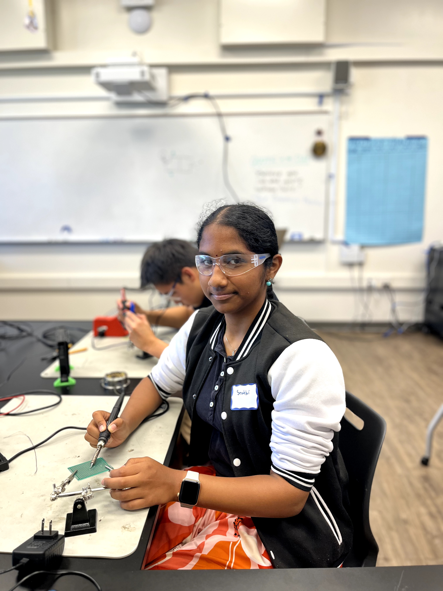
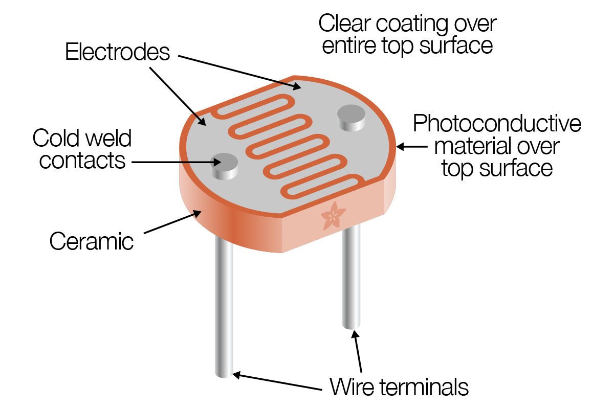

# Fall Detector
The fall detector has a small TinyML, a machine learning device in charge of detecting falls via the onboard accelerometer data, and reporting to a server through Bluetooth (BT). The server is a Python script that scans specific BT announcements, parses the fall alert information, and stores it into a SQL Lite database for reports and alerts. I choose to work on this project because my grandma has a medical condition where she falls when she suddenly hears a noise or when someome passes her unexpecedly. I created this fall detector to help her!

<!---
[Edit the paragraph above to make it better with this prompt] Replace this text with a brief description (2-3 sentences) of your project. This description should draw the reader in and make them interested in what you've built. You can include what the biggest challenges, takeaways, and triumphs from completing the project were. As you complete your portfolio, remember your audience is less familiar than you are with all that your project entails!

You should comment out all portions of your portfolio that you have not completed yet, as well as any instructions:
```HTML 
This is an HTML comment in Markdown
Anything between these symbols will not render on the published site -->

| **Engineer** | **School** | **Area of Interest** | **Grade** |
|:--:|:--:|:--:|:--:|
| Sruthi C | Lynbrook High School | Engineering | Incoming Sophomore

<!---**Replace the BlueStamp logo below with an image of yourself and your completed project. Follow the guide [here](https://tomcam.github.io/least-github-pages/adding-images-github-pages-site.html) if you need help.**-->


  
<!---# Final Milestone

**Don't forget to replace the text below with the embedding for your milestone video. Go to Youtube, click Share -> Embed, and copy and paste the code to replace what's below.**

<iframe width="560" height="315" src="https://www.youtube.com/embed/y3VAmNlER5Y" title="YouTube video player" frameborder="0" allow="accelerometer; autoplay; clipboard-write; encrypted-media; gyroscope; picture-in-picture; web-share" allowfullscreen></iframe>

For your final milestone, explain the outcome of your project. Key details to include are:
- What you've accomplished since your previous milestone
- What your biggest challenges and triumphs were at BSE
- A summary of key topics you learned about
- What you hope to learn in the future after everything you've learned at BSE


# Second Milestone

**Don't forget to replace the text below with the embedding for your milestone video. Go to Youtube, click Share -> Embed, and copy and paste the code to replace what's below.**

<iframe width="560" height="315" src="https://www.youtube.com/embed/y3VAmNlER5Y" title="YouTube video player" frameborder="0" allow="accelerometer; autoplay; clipboard-write; encrypted-media; gyroscope; picture-in-picture; web-share" allowfullscreen></iframe>

For your second milestone, explain what you've worked on since your previous milestone. You can highlight:
- Technical details of what you've accomplished and how they contribute to the final goal
- What has been surprising about the project so far
- Previous challenges you faced that you overcame
- What needs to be completed before your final milestone 
-->
# First Milestone
<!---
**Don't forget to replace the text below with the embedding for your milestone video. Go to Youtube, click Share -> Embed, and copy and paste the code to replace what's below.**

<iframe width="560" height="315" src="https://www.youtube.com/embed/CaCazFBhYKs" title="YouTube video player" frameborder="0" allow="accelerometer; autoplay; clipboard-write; encrypted-media; gyroscope; picture-in-picture; web-share" allowfullscreen></iframe>
-->

  Hi, I am Sruthi. I completed the first Milestone of my Main Project, The Fall Detector. My main project requires using Edge Impulse to creare a machine learning model. Edge impulse is an online platform where users can create and deplot their own machine learning models. My first milestone was to use the Arduino Nano 33 BLE Sensor to detect a fall. 
  
  My model and 2 classes, Fall and Stand. The model works by having the user drop/or not drop the arduino senser. If the user drops the arduino sensor, the model is able to accurately predict that a fall as occurred ussing the accelerometes on 3 axes of the sensor. If the user does not drop the arduino sensor, the model is also able to accurately predict that a fall as not occurred. 
 
  I first created an impulse on edge impulse(**See Figure 1**). The window size is the size od the data that will be processed per class, in milliseconds. The window increase is used when a sample is larger than the window size. If this is the case, the window increase is used to go over that sample. I also have 3 accelerometer axes in my model, which help detect falls. Then I classify these spectral features to have to outputs, Fall and Stand.
  
  Then I wanted my model to train 50 times with a learning rate of 0.0005. I also adjusted my validation set size to be 20%.  Then I started training my model. It was able identify all Stands correctly. It also identified most Falls correctly. It only identified very few Falls as Stands(**See Figure 2**). 

  Then I exported my model by Building my firmware and selecting Arduni Nano 33 BLE sensor as my board.. This will export the impulse, and build a binary that will run on your development board in a single step. Then I flashed the software and testing my Fall Detector(**See Figure 3**).

<!---
# Schematics 
Here's where you'll put images of your schematics. [Tinkercad](https://www.tinkercad.com/blog/official-guide-to-tinkercad-circuits) and [Fritzing](https://fritzing.org/learning/) are both great resoruces to create professional schematic diagrams, though BSE recommends Tinkercad becuase it can be done easily and for free in the browser. Put images here instead of paragraph.

 # Other Resources/Examples
One of the best parts about Github is that you can view how other people set up their own work. Here are some past BSE portfolios that are awesome examples. You can view how they set up their portfolio, and you can view their index.md files to understand how they implemented different portfolio components.
- [Example 1](https://trashytuber.github.io/YimingJiaBlueStamp/)
- [Example 2](https://sviatil0.github.io/Sviatoslav_BSE/)
- [Example 3](https://arneshkumar.github.io/arneshbluestamp/)

-->
# Starter Project

<!--**Don't forget to replace the text below with the embedding for your milestone video. Go to Youtube, click Share -> Embed, and copy and paste the code to replace what's below.**-->

<iframe width="560" height="315" src="https://www.youtube.com/embed/RBPeF8CwQ9M?si=p3Z9HswpC9CesJ2L" title="YouTube video player" frameborder="0" allow="accelerometer; autoplay; clipboard-write; encrypted-media; gyroscope; picture-in-picture; web-share" referrerpolicy="strict-origin-when-cross-origin" allowfullscreen></iframe>

  Hi, I am Sruthi. I did the Bluestamp Arduino Starter Project. There are two parts to my project, the input which is the photocell, and the output which is the LED light. The photocell is a sensor that can assist you to detect simple light ranges. In my project, I have used the photocell to sense if light is being blocked. If you are blocking the light by placing your finger on top of the photocell, then the LED light will light up. 
  
  Photocells are resistors that change its resistive value (in ohms Ω) depending on how much light is shining onto the squiggly face(**See Figure 1**). Each photocell sensor will act a little differently than the other, even if they are from the same batch. So you can expect to only be able to determine basic light changes. As I have mentioned before, photocell's resistance changes as the face is exposed to more light. When it is dark, the sensor looks like an large resistor up to 10MΩ(mega ohms), as the light level increases, the resistance goes down to a couple hundred. That’s why in my project, I have used the photo cell to sense if any light is being blocked.
  
  In my project, I wanted to light an external LED using the photocell. To do this, I connected one end of the resistor to the digital pin correspondent to the LED_BUILTIN constant. Then, I connected the positive(longer) leg of the LED to the other end of the resistor. I also connected the negative(shorter) leg of the LED to the GND.
  
  I wanted to program the LED to only light up when your finger touches the photosensor. To do this, I got the average value of the photocell when your finger is touching it. Then I created a condition. Only when the photocell reading is less than average value of the photocell reading, the LED will light up.


Figure 1 - Parts of a Photocell 

# Code
 
```
int photocellPin = 0;     
int photocellReading;    
int LEDpin = 11;          
int LEDbrightness;      

void setup(void) {
  Serial.begin(9600);
  pinMode(LED_BUILTIN, OUTPUT);   
}

void loop(void) {
  photocellReading = analogRead(photocellPin);  
  Serial.print("Analog reading = ");
  Serial.println(photocellReading); 
    if ((photocellReading) < 875) {
    digitalWrite(LED_BUILTIN, HIGH);   // turn the LED on (HIGH is the voltage level)
  } else {
    digitalWrite(LED_BUILTIN, LOW);
  } 
  photocellReading = 1023 - photocellReading;
  LEDbrightness = map(photocellReading, 0, 1023, 0, 255);
  analogWrite(LEDpin, LEDbrightness);
  
  delay(100);
}

```
<!---
# Bill of Materials
Here's where you'll list the parts in your project. To add more rows, just copy and paste the example rows below.
Don't forget to place the link of where to buy each component inside the quotation marks in the corresponding row after href =. Follow the guide [here]([url](https://www.markdownguide.org/extended-syntax/)) to learn how to customize this to your project needs. 

| **Part** | **Note** | **Price** | **Link** |
|:--:|:--:|:--:|:--:|
| Item Name | What the item is used for | $Price | <a href="https://www.amazon.com/Arduino-A000066-ARDUINO-UNO-R3/dp/B008GRTSV6/"> Link </a> |
| Item Name | What the item is used for | $Price | <a href="https://www.amazon.com/Arduino-A000066-ARDUINO-UNO-R3/dp/B008GRTSV6/"> Link </a> |
| Item Name | What the item is used for | $Price | <a href="https://www.amazon.com/Arduino-A000066-ARDUINO-UNO-R3/dp/B008GRTSV6/"> Link </a> |

# Other Resources/Examples
One of the best parts about Github is that you can view how other people set up their own work. Here are some past BSE portfolios that are awesome examples. You can view how they set up their portfolio, and you can view their index.md files to understand how they implemented different portfolio components.
- [Example 1](https://trashytuber.github.io/YimingJiaBlueStamp/)
- [Example 2](https://sviatil0.github.io/Sviatoslav_BSE/)
- [Example 3](https://arneshkumar.github.io/arneshbluestamp/)
To watch the BSE tutorial on how to create a portfolio, click here.
-->

