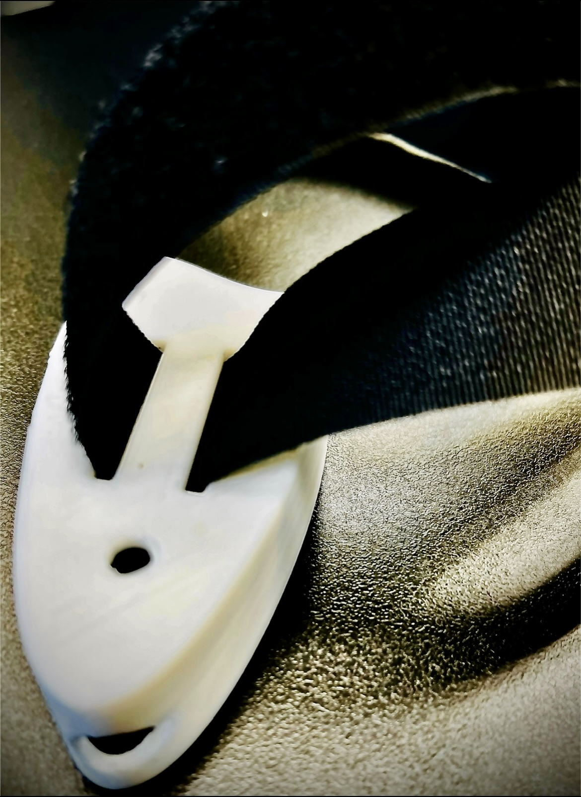

# Fall Detector
The fall detector has a small TinyML, a machine learning device in charge of detecting falls via the onboard accelerometer data. Only when a Fall occurs, the inbuilt LED light will turn Red. When a Fall has not occurred, the inbuilt LED light will stay at a green color. I choose to work on this project because my grandma has a medical condition where she falls when she suddenly hears a noise or when someone passes her unexpectedly. I created this fall detector to help her!

| **Engineer** | **School** | **Area of Interest** | **Grade** |
|:--:|:--:|:--:|:--:|
| Sruthi C | Lynbrook High School | Engineering | Incoming Sophomore |


  
# Third(Final) Milestone: Putting The Fall Detector Together with Schematics

<iframe width="560" height="315" src="https://www.youtube.com/embed/Hj8J3zDPKIc?si=5vd0iITn1NmihyBR" title="YouTube video player" frameborder="0" allow="accelerometer; autoplay; clipboard-write; encrypted-media; gyroscope; picture-in-picture; web-share" referrerpolicy="strict-origin-when-cross-origin" allowfullscreen></iframe>

  I completed the third milestone of my Main Project, The Fall Detector! For my third milestone, I retrained my model so it would be very accurate in detecting falls and also made my entire device fully wearable! I wear the Arduino Nano in the 3D printed case with a velcro strapped attached to my waist. This was a mechanical engineering and machine learning oriented milestone. To summarize my project, in my first milestone, I flashed the software on the terminal and tested my Fall Detector through the Arduino IDE. For my second milestone, I built upon my system so my model would be able to run directly on the Arduino instead of the Terminal and furthermore, the inbuilt LED would turn red or green based on the detection of a fall or a stand. Putting this all together in my final milestone, I tested to see if my Fall Detector was working and it worked!
  
**Machine Learning**

  The first step in my third milestone was to retrain my model. I did this by adding 240 seconds of more data. I wanted to do this since I realized that my model would sometimes detect a fall even though I was not falling. Therefore, I went to Edge Impulse to retrain my model, built the Arduino library by deploying my model, and added the library to Arduino IDE (**See Figure 1**).


Figure 1 - Retraining my ML model using Edge-Impulse and building the Arduino Library.

  When compiling the Arduino code on the IDE, I ran into some challenges. I came across the error “Could not find Arduino on port”. In an attempt to fix this issue, I tried switching ports and then compiling my program again. However, this was to no avail. Finally, I decided to uninstall the Arduino Board from the Boards Manager. After doing this step, I re-installed the board, but this time I installed a lower version. When I compiled this, the code was successfully running on the Arduino.

**Mechanical Engineering**

  The next step was to attach all the parts together. I took my 3D printed case and examined it(**See Figure 2**). There were two thin lines and one circular hole at the bottom. I knew the two thin lines were used for the strap, so I decided to use the circular hole to insert the wire. This way, the Arduino could be attached to the battery pack and my Fall Detector would be able to turn on and work. An early challenge I ran into with this 3D printed case was how to power my project when the wire would not fit through the circular hole into the 3D printed part(**See Figure 3**).


Figure 2 - 3D printed case design.


Figure 3 - 3D printed case with straps attached and circular hole that is not big enough for the wire to pass through.

  To address this issue, I had 2 ideas.
    **1.** I could cut the wire and insert it inside the hole. Then I could solder it back together.
    **2.** I could make a bigger hole using the dremel and just insert the wire inside of this new hole.
    
The first idea would take a long time and I would need to put in way more effort. However, the second idea would be a bit dangerous as I would use the Dremel tool. Yet, it would still be easier and take way less time than the first idea. Therefore, I went to execute my second idea. 

  While using the Dremel I had to wear heavy gloves and safety glasses. The Dremel is a tool that uses a rotating tip. Since I was drilling a hole into a plastic 3D printed part, I had to be extremely careful not to melt the plastic all over the 3D printed part. I had to practice using the dremel at one of its highest speeds on wood first, using it for a few seconds at a time. Once I got the hang of this, I was able to create an oval shaped hole in my 3D printed part (**See Figure 4**).



Figure 4 - 3D printed case with hole drilled using a Dremel.
 
  After I fit the wire through, I was able to attach it to the Arduino as well as the battery pack. Now I decided to wear the strap with my 3D printed case that had my Arduino attached to the battery pack. After I wore my project, I decided to test it out. I turned the battery pack on and started standing/walking and falling.
 
  When I was testing my project, I ran into 2 complications. One of them was that my 3D printed lid would often fall onto the floor. To address this issue, I took two black twist-ties and twisted them together to create one long twist-tie. I then twisted it around my 3D printed case, securing the lid (**See Figure 5**). 


Figure 5 - Makeshift rubber band made from 2 twist-ties to hold 3D printed lid onto case.
 
  Now, when I tested my project, the lid was staying on and secured to the case. With this issue addressed I could now focus on testing my project. My Fall Detector is able to correctly identify if a Fall occurred or not. However, I noticed that the position of the arduino keeps on changing the case. Sometimes, you can not see the Red or Green lights. To fix this issue, I took some of the foam that came with the Arduino case and ripped it up. I then positioned the Arduino in a position where the light is visible. Finally, I used the tiny foam pieces that I ripped and stuffed them into the empty spaces as a wedge. This way the Arduino is not able to move(**See Figure 6**).


Figure 6 - Arduino tightly placed inside the 3D printed case using foam.

**Integrating the project together**

  After this, I tested my project a few more times to check if everything worked properly. When standing, sitting, or walking, the light would be green. But whenever I fall hard or soft, on the floor or the chair, it doesn’t matter. My Fall Detector can detect that as a fall and change the LED light from Green to Red. From this, I know that my Fall Detector is working accurately!

  Overall, throughout my time at Bluestamp I learned many things. My project requires me to use Machine Learning via Edge Impulse and an Arduino Nano 33 BLE Sense along with Arduino IDE. Before Bluestamp, I did not know what any of these things were. But throught my time here, I learned how to connect an Arduino Nano to my laptop, how to create a machine learning model using edge impulse, and how to program code using Arduino. I learned about the different accelerometer values used in my project, the inbuilt LED light, and how to use the command line interface too. I hope to use these skills in the future to create something new that will help make people’s lives easier.

  One thing I liked about Bluestamp was that I was not only able to work on my project, but I was able to help my peers with their projects as well. I liked how we would take breaks and just forget about the problems we had in our projects. During the breaks we would bond with other students and enjoy our break time. This really taught me to work while I work and play when I play. I learned a lot of things from other projects that I could use in mine such as how to balance the training set of the data I collected. I also learned how to use the unix based terminals and found two important commands such as change directory and list commands. Before coming to Bluestamp, I did not know how to do a lot of these things but after my time here, I know how to do so many. Bluestamp has really helped me improve my skill sets that I need in my life.

# Second Milestone: LED Light incorporated with Fall Detector with Schematics

<iframe width="560" height="315" src="https://www.youtube.com/embed/pYVFgmePl9U?si=sBD4cOcIjoAsiElG" title="YouTube video player" frameborder="0" allow="accelerometer; autoplay; clipboard-write; encrypted-media; gyroscope; picture-in-picture; web-share" referrerpolicy="strict-origin-when-cross-origin" allowfullscreen></iframe>

I completed the second Milestone(**See Figure 1**) of my Main Project, The Fall Detector! In my first Milestone, I flashed the software on the terminal and tested my Fall Detector through the API(**See Figure 2**). For the second Milestone, I built upon my system so my model would be able to run directly on the Arduino instead of the Terminal(**See Figure 3**) and furthermore, the inbuilt LED would turn Red or Green based on the detection of a Fall or a Stand.


Figure 1 - Simple Flowchart of Milestone 2.


Figure 2 -  Complex Flowchart of Milestone 1.


Figure 3 -  Complex Flowchart of Milestone 2.

  I added the functionality of Green when Standing and Red when Falling. To do this, I had to:
**1.** Go to edge-impulse and deploy my project. 
**2.** Convert it into a ZIP.file and add the ZIP.file as a Library to the Arduino IDE. 
**3.** Now, I tested my project in Arduino and it worked. I made my project run only on the Arduino device instead of running in the terminal.

  I also made the Builtin LED light up in my second Milestone so the user can visually detect falls. Red light corresponds to a “Fall”. Green light corresponds to a “Stand”. In order to do this, I had to:
**1.** Using the ML model I trained from edge impulse, I had two classes: “Fall” and “Stand”
**2.** I used an “if” condition to check if a “Fall” or “Stand” occurRed.
**3.** If the class name was “Fall” and only if the chance of falling is 50% or higher, I made the LED light turn Red(**See Figure 4**).


Figure 4 - Arduino Nano 33 BLE Sense Board Inbuilt LED lights up Red after detecting a _Fall_.

**4.** Then I added a “break” command since I have no reason to go to the “else” statement and check for “Stand” since I already know it is a “Fall” since the light turned Red.
**5.** If the class name was “Stand” and/or if the chance of falling is 50% or less, I made the LED light turn Green(**See Figure 5**).


Figure 4 - Arduino Nano 33 BLE Sense Board Inbuilt LED lights up Red after detecting a _Stand_.

**6.** All this code was in a loop so it will keep on repeating.

  Some challenges popped up when I was trying to compile the Arduino code. An error would occur but it would not highlight any problems in the code. I later on realized I have an Arduino Nano 33 BLE Sense but I was running the program for an Arduino Nano 33 BLE Sense Rev2. So when I changed and ran my code on the program compatible with my board, it worked without any errors. However, another error would occur stating that the board was not connected to the port when it clearly was. So then I decided to unplug the wires and flip it over. Then I compiled the code again and it worked! But everytime I try to compile the code, It would take a long time for it to compile and upload and finally execute my code. So, when I fixed my code to run without any errors. I would compile it multiple times to make the speed of compiling faster. This helped because now when I want to compile the code it takes up a much shorter time than before. 
  
  I am very excited to put all the parts together and finally make it wearable in my third Milestone!

# Code 
```cpp
/* Includes ---------------------------------------------------------------- */
#include <Fall-Detector-BSE_inferencing.h>
#include <Arduino_LSM9DS1.h> //Click here to get the library: https://www.arduino.cc/reference/en/libraries/arduino_lsm9ds1/
/* Constant defines -------------------------------------------------------- */
#define CONVERT_G_TO_MS2    9.80665f
#define MAX_ACCEPTED_RANGE  2.0f        // starting 03/2022, models are generated setting range to +-2, but this example use Arudino library which set range to +-4g. If you are using an older model, ignore this value and use 4.0f instead
/* Private variables ------------------------------------------------------- */
static bool debug_nn = false; // Set this to true to see e.g. features generated from the raw signal
void setup()
{
    Serial.begin(115200);
    Serial.println("Edge Impulse Inferencing Demo");

    if (!IMU.begin()) {
        ei_printf("Failed to initialize IMU!\r\n");
    }
    else {
        ei_printf("IMU initialized\r\n");
    }

    if (EI_CLASSIFIER_RAW_SAMPLES_PER_FRAME != 3) {
        ei_printf("ERR: EI_CLASSIFIER_RAW_SAMPLES_PER_FRAME should be equal to 3 (the 3 sensor axes)\n");
        return;
    }
  pinMode(LED_BUILTIN, OUTPUT);
  #define RED 22
  #define GREEN 23
  pinMode(RED, OUTPUT);
  pinMode(GREEN, OUTPUT);
}
float ei_get_sign(float number) {
    return (number >= 0.0) ? 1.0 : -1.0;
}
void loop()
{
    ei_printf("\nStarting inferencing in a second...\n");
    delay(100);
    ei_printf("Sampling...\n");
    float buffer[EI_CLASSIFIER_DSP_INPUT_FRAME_SIZE] = { 0 };
    for (size_t ix = 0; ix < EI_CLASSIFIER_DSP_INPUT_FRAME_SIZE; ix += 3) {
        uint64_t next_tick = micros() + (EI_CLASSIFIER_INTERVAL_MS * 1000);
        IMU.readAcceleration(buffer[ix], buffer[ix + 1], buffer[ix + 2]);
        for (int i = 0; i < 3; i++) {
            if (fabs(buffer[ix + i]) > MAX_ACCEPTED_RANGE) {
                buffer[ix + i] = ei_get_sign(buffer[ix + i]) * MAX_ACCEPTED_RANGE;
            }
        }
        buffer[ix + 0] *= CONVERT_G_TO_MS2;
        buffer[ix + 1] *= CONVERT_G_TO_MS2;
        buffer[ix + 2] *= CONVERT_G_TO_MS2;
        delayMicroseconds(next_tick - micros());
    }
    signal_t signal;
    int err = numpy::signal_from_buffer(buffer, EI_CLASSIFIER_DSP_INPUT_FRAME_SIZE, &signal);
    if (err != 0) {
        ei_printf("Failed to create signal from buffer (%d)\n", err);
        return;
    }
    ei_impulse_result_t result = { 0 };
    err = run_classifier(&signal, &result, debug_nn);
    if (err != EI_IMPULSE_OK) {
        ei_printf("ERR: Failed to run classifier (%d)\n", err);
        return;
    }
    ei_printf("Predictions ");
    ei_printf("(DSP: %d ms., Classification: %d ms., Anomaly: %d ms.)",
        result.timing.dsp, result.timing.classification, result.timing.anomaly);
    ei_printf(": \n");
    for (size_t ix = 0; ix < EI_CLASSIFIER_LABEL_COUNT; ix++) {
        ei_printf("    %s: %.5f\n", result.classification[ix].label, result.classification[ix].value);
        if (((result.classification[ix].label) == "Fall") and (result.classification[ix].value >=0.5)) {
          digitalWrite(GREEN, HIGH);
          delay(1000);           // Red Light
          digitalWrite(GREEN, LOW);  
          break;
        } else {
          digitalWrite(RED, HIGH);  
          delay(1000);                      // Green Light   
          digitalWrite(RED, LOW); 
        }
    }
#if EI_CLASSIFIER_HAS_ANOMALY == 1
    ei_printf("    anomaly score: %.3f\n", result.anomaly);
#endif
}
#if !defined(EI_CLASSIFIER_SENSOR) || EI_CLASSIFIER_SENSOR != EI_CLASSIFIER_SENSOR_ACCELEROMETER
#error "Invalid model for current sensor"
#endif

```

# First Milestone:Machine Learning Prediction of Simulated Falls with Schematics

<iframe width="560" height="315" src="https://www.youtube.com/embed/7f9FMkugbJ4?si=5AjQr96oZtKGsjZm" title="YouTube video player" frameborder="0" allow="accelerometer; autoplay; clipboard-write; encrypted-media; gyroscope; picture-in-picture; web-share" referrerpolicy="strict-origin-when-cross-origin" allowfullscreen></iframe>

  I completed the first Milestone of my Main Project, The Fall Detector. My main project requires using Edge Impulse to create a machine learning model and then deploy on an edge device. Here that edge device is an Arduino microcontroller. Edge impulse is an online platform where users can create and deploy their own machine learning model(s). My first milestone was to use the Arduino Nano 33 BLE Sensor to detect a simulated fall.
  
  My model has 2 classes: 1) Fall and 2) Stand. In this initial demo, the user drops the microcontroller or leaves it idle. If the user drops the Arduino, the model is able to accurately predict that a fall has occurred using the accelerometers inside the Arduino. Accelerometers measure the acceleration of an object, on the 3 axes of the sensor. If the user does not drop the Arduino sensor, the model is also able to accurately detect that a fall has not occurred.
 
  I first created an impulse on edge impulse(**See Figure 1**). The window size is the size of the data that will be processed per class. The window increase is used when a sample is larger than the window size. If this is the case, the window increase is used to go over that sample. An example is if I collected a 10 second stream but my window size is one second, then the data would be split into ten one second samples. Then I classify these spectral features to have two outputs, Fall and Stand.
  


Figure 1 - Creating an impulse with the workflow… 1.Collecting Data; 2.Preprocessing the data; 3.Designing the Neural Network; 4.Training the model.
  
  I trained my model with 50 epochs. An epoch is one complete pass of the training dataset through the algorithm. I also put a learning rate of 0.0005(**See Figure 2**). I also adjusted my validation set size to be 20%(**Figure 3**). Then I started training my model. It was able to identify all Stands correctly. It also identified most Falls correctly. It only identified very few Falls as Stands (**See Figure 4 and 5**)

.

Figure 2 - Effect of Learning Rate; Reference: Deep Learning by Subir Varma and Sanjiv Das


Figure 3 - Neural Network Overview, (Left) my Fully connected Neural Net, (Right) Hyperparameter Settings.


Figure 4 - Results on Validation Set of Fall Data.


Figure 5 - Example Data of Stand(Scaled from -60 to 60)  versus Fall (Scaled from -2000 to 2000 with a lot of movement in gyrX, gyrY, and gryZ).

  Then I exported my model from online edge impulse by building my firmware and selecting Arduino Nano 33 BLE Microcontroller as my board. This will export the impulse, and build a binary that will run on your development board in a single step. Then I flashed the software and tested my Fall Detector in real time (**See Figure 6**).
  
<details>
<summary>
Predictions (DSP: 54 ms., Classification: 0 ms., Anomaly: 0 ms.): 
#Classification results:
    Fall: 0.007813
    Stand: 0.992187
</summary>
  
```cpp
Starting inferencing in 2 seconds...
Sampling...
Predictions (DSP: 54 ms., Classification: 0 ms., Anomaly: 0 ms.): 
#Classification results:
    Fall: 0.000000
    Stand: 0.996094
Starting inferencing in 2 seconds...
Sampling...
Predictions (DSP: 54 ms., Classification: 0 ms., Anomaly: 0 ms.): 
#Classification results:
    Fall: 0.003906
    Stand: 0.996094
Starting inferencing in 2 seconds...
Sampling...
Predictions (DSP: 54 ms., Classification: 0 ms., Anomaly: 0 ms.): 
#Classification results:
    Fall: 0.000000
    Stand: 0.996094
Starting inferencing in 2 seconds...
Sampling...
Predictions (DSP: 54 ms., Classification: 0 ms., Anomaly: 0 ms.): 
#Classification results:
    Fall: 0.996094
    Stand: 0.003906
Starting inferencing in 2 seconds...
Sampling...
Predictions (DSP: 54 ms., Classification: 0 ms., Anomaly: 0 ms.): 
#Classification results:
    Fall: 0.000000
    Stand: 0.996094
Starting inferencing in 2 seconds...
Sampling...
Predictions (DSP: 54 ms., Classification: 0 ms., Anomaly: 0 ms.): 
#Classification results:
    Fall: 0.003906
    Stand: 0.996094
Starting inferencing in 2 seconds...
Sampling...
Predictions (DSP: 54 ms., Classification: 0 ms., Anomaly: 0 ms.): 
#Classification results:
    Fall: 0.000000
    Stand: 0.996094
Starting inferencing in 2 seconds...
Sampling...
Predictions (DSP: 54 ms., Classification: 0 ms., Anomaly: 0 ms.): 
#Classification results:
    Fall: 0.996094
    Stand: 0.000000
Starting inferencing in 2 seconds...
Sampling...
Predictions (DSP: 53 ms., Classification: 0 ms., Anomaly: 0 ms.): 
#Classification results:
    Fall: 0.000000
    Stand: 0.996094
Starting inferencing in 2 seconds...
Sampling...
Predictions (DSP: 54 ms., Classification: 0 ms., Anomaly: 0 ms.): 
#Classification results:
    Fall: 0.000000
    Stand: 0.996094
Starting inferencing in 2 seconds...
Sampling...
Predictions (DSP: 54 ms., Classification: 0 ms., Anomaly: 0 ms.): 
#Classification results:
    Fall: 0.000000
    Stand: 0.996094
Starting inferencing in 2 seconds...
Sampling...
Predictions (DSP: 54 ms., Classification: 0 ms., Anomaly: 0 ms.): 
#Classification results:
    Fall: 0.097656
    Stand: 0.902344
Starting inferencing in 2 seconds...
Sampling...
Predictions (DSP: 54 ms., Classification: 0 ms., Anomaly: 0 ms.): 
#Classification results:
    Fall: 0.015625
    Stand: 0.984375
Starting inferencing in 2 seconds...
Sampling...
Predictions (DSP: 54 ms., Classification: 0 ms., Anomaly: 0 ms.): 
#Classification results:
    Fall: 0.007813
    Stand: 0.992187
Starting inferencing in 2 seconds...
Sampling...
Predictions (DSP: 54 ms., Classification: 0 ms., Anomaly: 0 ms.): 
#Classification results:
    Fall: 0.007813
    Stand: 0.992187
Starting inferencing in 2 seconds...
Sampling...
Predictions (DSP: 54 ms., Classification: 0 ms., Anomaly: 0 ms.): 
#Classification results:
    Fall: 0.023437
    Stand: 0.976562
Starting inferencing in 2 seconds...
Sampling...
Predictions (DSP: 54 ms., Classification: 0 ms., Anomaly: 0 ms.): 
#Classification results:
    Fall: 0.042969
    Stand: 0.957031
```
Figure 6 - Fall Detector Tested in Real Time.

</details>
  
  Before flashing the software, I had to use “cd” (changes the directory) and “ls ”(gives the ordered list of filenames in a directory file) commands to navigate to the correct folder which contained the software to flash. In order for the software to run/flash properly, I had to put “sudo”(super user do) in front of the command, “./flash_mac_command”. Once it was flashing the software properly, I was finally able to run edge-impulse-run-impulse.

  But before being able to create my Model, I first had to connect my Arduino board to my laptop through edge impulse. But before I could do this, I had to...
  **1.** Install the Arduino-cli. When I was doing this, my computer ran into a lot of issues. My computer did not have admin permissions, and the initial account/user did not have user permissions. 
  **2.** So, I created a new profile with admin permissions and redid the whole process to see if it would work. While doing this, I ran into some issues with Homebrew. So I decided to install the brew library onto my laptop. 
  **3.** Soon after, I ran into an issue with the Arduino-cli. It had failed to install because the newest version,the version I had installed, was unstable on my mac.
  **4.** So, I uninstalled this unstable version, and reinstalled Arduino version 0.35 and repeated the process all over again. I decided to add “/Users/Sruthi/bin” to my $PATH as I kept on getting a $PATH error. A $PATH is an environment variable that tells the bash shell where to find different executable files and scripts.
  **5.** But soon after, there was an error with the BASH on my computer. Bash scripts are files containing code that tell the computer to do something. And since there was some error with my computer’s bash, I had to change it manually.
  **6.** So, I manually edited the bash and then saved it. After all this, I ran the program all over again. Then I used the “ls”, “cd”, and “sudo” commands to navigate to the folder where the Arduino firmware was. 
  **7.** Now, I tried to flash the command “./flash_mac_test.sh”. It finally flashed the software and asked for my username and password for my edge impulse account. 
  **8.** Once I typed this in, I was able to choose which project I wanted to connect my arduino to. Then my Arduino was connected to my laptop through edge impulse. 
  **9.** Now, I was finally able to create a Model to detect falls using edge impulse.

  I look forward to the next portion of my project!

# Starter Project with Schematics

<iframe width="560" height="315" src="https://www.youtube.com/embed/RBPeF8CwQ9M?si=p3Z9HswpC9CesJ2L" title="YouTube video player" frameborder="0" allow="accelerometer; autoplay; clipboard-write; encrypted-media; gyroscope; picture-in-picture; web-share" referrerpolicy="strict-origin-when-cross-origin" allowfullscreen></iframe>

  Hi, I am Sruthi. I did the Bluestamp Arduino Starter Project. There are two parts to my project, the input which is the photocell, and the output which is the LED light. The photocell is a sensor that can assist you to detect simple light ranges. In my project, I have used the photocell to sense if light is being blocked. If you are blocking the light by placing your finger on top of the photocell, then the LED light will light up. 
  
  Photocells are resistors that change its resistive value (in ohms Ω) depending on how much light is shining onto the squiggly face(**See Figure 1**). Each photocell sensor will act a little differently than the other, even if they are from the same batch. So you can expect to only be able to determine basic light changes. As I have mentioned before, a photocell's resistance changes as the face is exposed to more light. When it is dark, the sensor looks like a large resistor up to 10MΩ(mega ohms), as the light level increases, the resistance goes down to a couple hundred. That’s why in my project, I have used the photocell to sense if any light is being blocked.


Figure 1 - Parts of a Photocell.
  
  In my project, I wanted to light an external LED using the photocell. To do this, I connected one end of the resistor to the digital pin corresponding to the LED_BUILTIN constant. Then, I connected the positive(longer) leg of the LED to the other end of the resistor. I also connected the negative(shorter) leg of the LED to the GND(**See Figure 2**).


Figure 2 - Circuit of an LED connection.
  
  I wanted to program the LED to only light up when your finger touches the photosensor. To do this, I got the average value of the photocell when your finger is touching it. Then I created a condition. Only when the photocell reading is less than average value of the photocell reading, the LED will light up.
  
# Code 
```cpp
int photocellPin = 0;     
int photocellReading;    
int LEDpin = 11;          
int LEDbrightness;      

void setup(void) {
  Serial.begin(9600);
  pinMode(LED_BUILTIN, OUTPUT);   
}

void loop(void) {
  photocellReading = analogRead(photocellPin);  
  Serial.print("Analog reading = ");
  Serial.println(photocellReading); 
    if ((photocellReading) < 875) {
    digitalWrite(LED_BUILTIN, HIGH);   // turn the LED on (HIGH is the voltage level)
  } else {
    digitalWrite(LED_BUILTIN, LOW);
  } 
  photocellReading = 1023 - photocellReading;
  LEDbrightness = map(photocellReading, 0, 1023, 0, 255);
  analogWrite(LEDpin, LEDbrightness);
  
  delay(100);
}
```
# Bill of Materials for Main Project
| **Part** | **Note** | **Price** | **Link** |
|:--:|:--:|:--:|:--:|
| Arduino Nano 33 BLE Sense | Used for Fall Detection and Arduino Programming | $45.95 | <a href="https://www.amazon.com/Arduino-Nano-33-BLE/dp/B07WV59YTZ/ref=sr_1_4?crid=1TKQQNZ7YPAD9&dib=eyJ2IjoiMSJ9.dhczs6UK7D4jeS6ohbXhWne91Th6rZeMDN46m9rlNY6FuwTojNoRfyP5tM90G4nSkneZz75CgR3J9S8HJbMwmkdgxmsYGyTnWd4A5Gv3Z4pq6iBsPKhYwAQut9Eca0ypZSAfAnLhi4nUxVlC1ThSHSRpn2bxMM7kr0hCoHTfy_WR6WG47Wkb-2N4BBHMWWRDwuRy9xPFdjkhBYRwJ5BVMVA17iNFnkpYbaZLWORtKvY.lesmexjeGJoiYJpTIqx02w2hmiqaTjSBbto7AoPif-E&dib_tag=se&keywords=arduino+nano+33+ble+sense+rev+1&qid=1721172610&sprefix=arduino+nano+33+ble+sense+%2Caps%2C134&sr=8-4"> Link </a> |
| Twist-wires | Used to secure 3D lid onto 3D printed part | $4.98 | <a href="https://www.amazon.com/Twist-Plastic-Reusable-Household-Office/dp/B09GFHPJBZ/ref=sr_1_7?crid=14C0HVL6JKRS8&dib=eyJ2IjoiMSJ9.ejh_Iweyjy2dEJD590O0BfVfMQ_o0DkmoIS3gDSXE3YUhjug4xilHoxtbqXKMbmG14WvxNRA97dvtTStWsjXEhrI4UZ7j2KypMebJV2gDbIhBJKgQz1VHcVdoPsZbwHR4bg5S9Wyr7EG6QkY285u5Fl8P25Nxbw-90TmDy4pjHxkPskoGcX1GGNUBw7f400SoUy-u4895nqrB4-5qlqYMLwffYBky3C0SY7WTvJzfQHS7DeNK-RqsPBJ_Ev9pDt_4Oi1nacU6Fe1XFCyIVo50b_vEl3tJbkh22f7AtZPitQ.GhvNj-AgmAu4bOuVtC_wTH-xbK4OwDfvgFhA0Hu2FHw&dib_tag=se&keywords=twist-wires&qid=1721172805&sprefix=twist-wire%2Caps%2C153&sr=8-7&th=1"> Link </a> |
| Portable Charger/Battery Pack | Used to power the Arduino when being worn | $21.99 | <a href="https://www.amazon.com/Anker-PowerCore-Ultra-Compact-High-Speed-Technology/dp/B01CU1EC6Y?th=1"> Link </a> |
